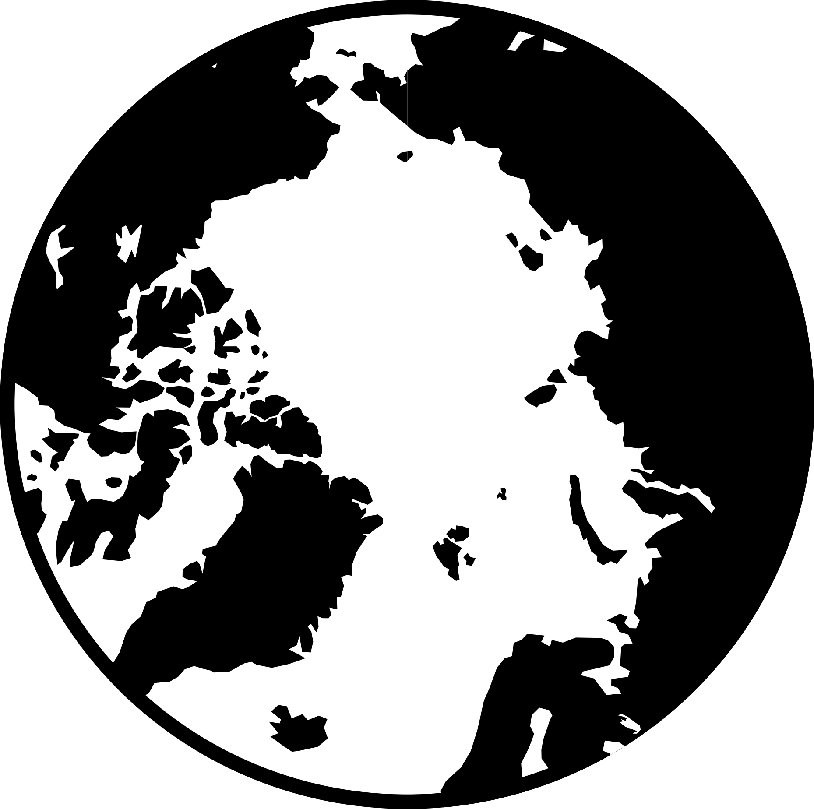
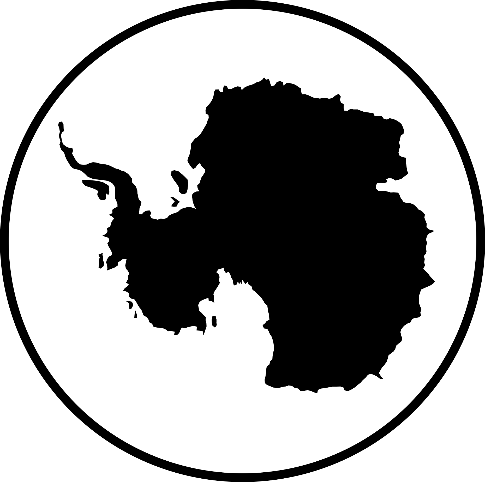

# Make Arctic / Antarctic logos

Python script to generate circular polar projection logos for Arctic and Antarctic regions using Cartopy and Matplotlib.

## Installation

```bash
# create virtual env
pip -m venv .venv
source .venv/bin/activate
# install dependencies
pip install -r requirements.txt
```

## Usage

### Basic Usage

Generate default logos (transparent ocean, black land):

```bash
python main.py
```

This creates:
- `output/arctic.png` - Transparent ocean
- `output/antarctic.png` - Transparent ocean
- `output/arctic_filled.png` - White ocean fill
- `output/antarctic_filled.png` - White ocean fill

### Example Output

<p align="center">
  
  
</p>

By default, logos have transparent ocean areas (only land and border are visible), making them ideal for overlaying on any background; set `fill_ocean=True` to add a solid ocean color inside the circle while keeping the outside transparent.

### Custom Options

```python
from arctic_antarctic_logo import make_arctic_logo, make_antarctic_logo

# White ocean background with black land
make_arctic_logo(
    filename='arctic_white.png',
    fill_ocean=True,
    fill_lakes=True,
    ocean_colour='white'
)

# Light blue ocean, no lake filling
make_antarctic_logo(
    filename='antarctic_blue.png',
    fill_ocean=True,
    fill_lakes=False,
    ocean_colour='#88ccff',
    land_colour='#2c3e50',
    border_colour='#34495e',
    border_width=10
)
```

### Parameters

| Parameter | Default | Description |
|-----------|---------|-------------|
| `filename` | `arctic_logo.png` / `antarctic_logo.png` | Output filename |
| `dpi` | `600` | Resolution (dots per inch) |
| `ocean_colour` | `"white"` | Color for ocean (if filled) |
| `land_colour` | `"black"` | Color for land masses |
| `border_colour` | `"black"` | Color for circular border |
| `border_width` | `8` | Width of circular border in pixels |
| `fill_ocean` | `False` | Fill ocean areas with `ocean_colour` |
| `fill_lakes` | `False` | Fill lakes with `ocean_colour` |

## License

MIT

